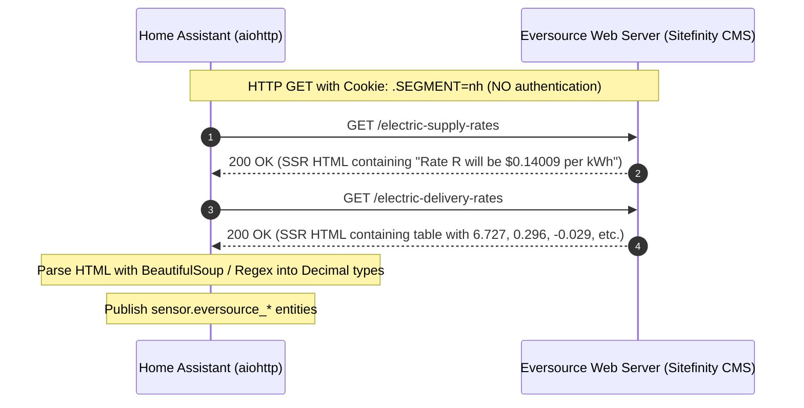

# Eversource Tariff Investigation — Executive Summary

## 1. Investigation Purpose
This authorized, read-only forensic investigation was performed to identify the exact origin of residential electricity tariff rates displayed on Eversource New Hampshire web pages, with the specific goal of supporting an open-source Home Assistant / HACS integration.

The target rates analyzed correspond to New Hampshire **Rate R** residential service:
- **Supply Rate:** $0.14009 / kWh (effective August 1, 2026 – January 31, 2027)
- **Delivery Rate (Variable Sum):** $0.11909 / kWh
  - Distribution Charge: $0.06727 / kWh (6.727 ¢/kWh)
  - Regulatory Reconciliation Adjustment: $0.00296 / kWh (0.296 ¢/kWh)
  - Pole Plant Adjustment Mechanism: -$0.00029 / kWh (-0.029 ¢/kWh)
  - Transmission Charge: $0.04445 / kWh (4.445 ¢/kWh)
  - Stranded Cost Recovery Charge: -$0.00148 / kWh (-0.148 ¢/kWh)
  - System Benefits Charge: $0.00618 / kWh (0.618 ¢/kWh)
- **Customer Charge (Fixed Monthly):** $19.81 / month
- **Total Variable Rate (Supply + Delivery):** $0.25918 / kWh

---

## 2. Key Forensic Findings

| Question / Area | Finding |
|---|---|
| **Data Origin** | **Server-Side Rendered (SSR) HTML** generated by Progress Sitefinity CMS. |
| **Public vs Authenticated** | **100% Public.** No login, session ID, ASP.NET auth token, or credentials are required. |
| **Location Mechanism** | Audience segmentation is controlled via the public HTTP cookie **`.SEGMENT=nh`**. |
| **REST / JSON APIs** | **No public JSON API exists** for rate data. Personalization endpoints (`/RestApi/personalizations/render`) return only navigation chrome and header controls, containing zero tariff values. |
| **JavaScript Hydration** | Not required. The HTML arrives pre-rendered with the exact numbers directly in the initial HTTP response body. |
| **Fetch Reproducibility** | Trivially reproducible using standard asynchronous HTTP clients (`aiohttp`, `requests`, `httpx`, `curl`). |

---

## 3. High-Level Architecture Summary

---

## 4. Stability Assessment
- **Reliability:** High. Server-rendered content is immune to client-side JavaScript execution issues, headless browser detection, or bot challenges that plague dynamic single-page applications.
- **Maintenance Footprint:** Very low. Tariffs change bi-annually (Supply: Feb 1 / Aug 1) and quarterly (Delivery: Jan 1 / Feb 1 / Aug 1 / Oct 1). Infrequent polling (e.g., once every 6 to 12 hours) creates negligible load.
